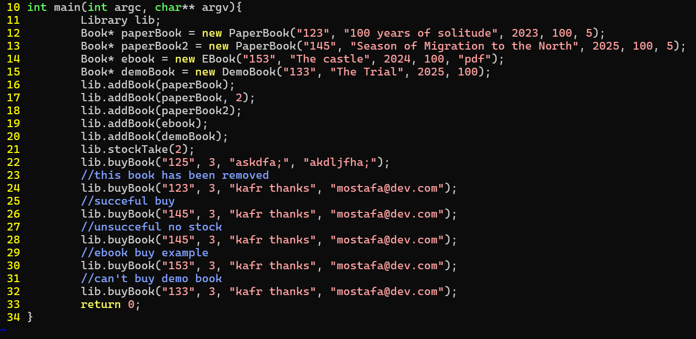
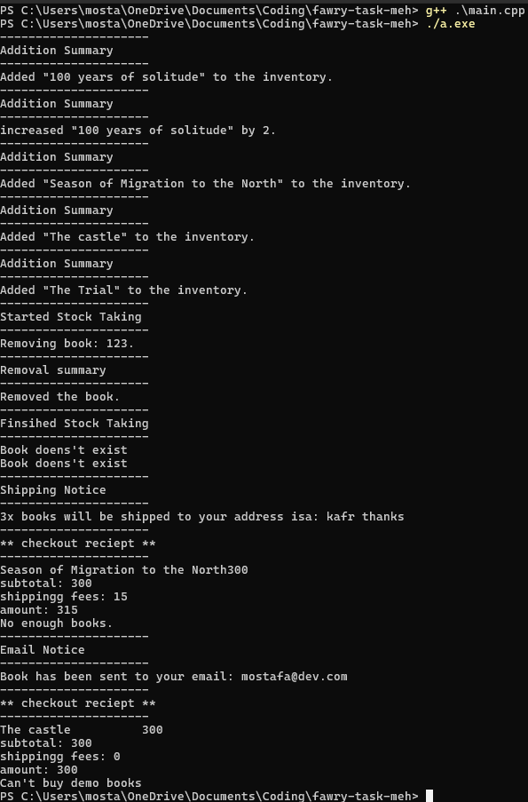

# How to run
compile main.cpp and run the resulting excutable, ```main.cpp``` contains some tests.
```
g++ ./main.cpp
./a.exe
```
# OOP-Library
in this project I have made an OOP cart that has four types of products:
  - Paper book
  - EBook
  - Demo Book (can't be bought)
these classes are derived from a common interface called Book and they differ on how to they return their type 
I should have implmented Library class as a singleton but had no time to do so
# Screenshots
# Screenshots
| Code | result |
| -------- | -------- | 
|  |  | 
